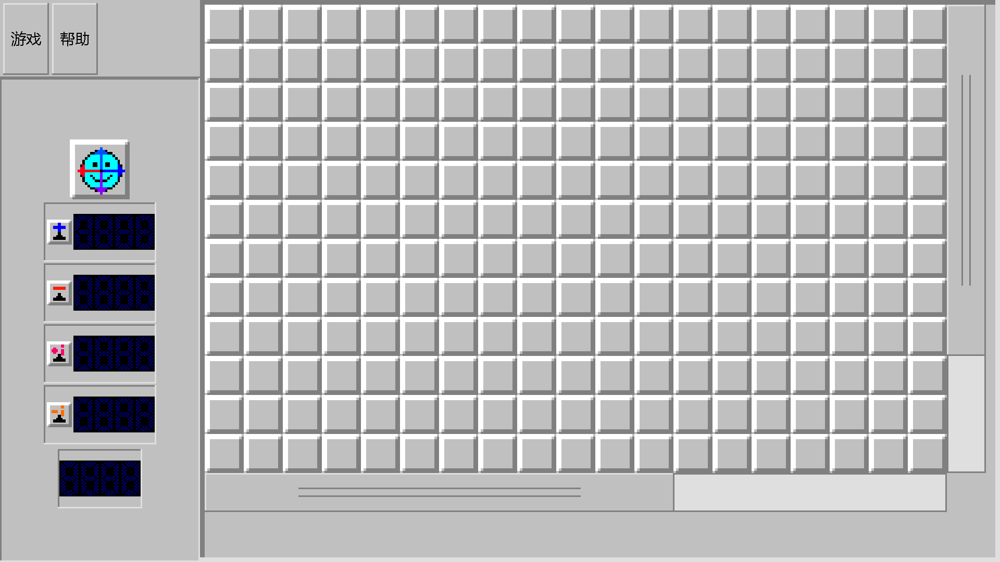

# 复扫雷 Complexweeper

> 扫雷，但雷是**复数**：格子上的数字是周围所有雷之和的**模长**。

[](https://github.com/wang-503/complexweeper-A-minesweeper-game/actions/workflows/build.yml)
[](LICENSE)
[](#下载与安装)

---

## 这是什么

经典扫雷只有一种雷（`+1`）。复扫雷把雷扩展成**四种复数单位**：

| 雷 | 值 | 颜色 |
| --- | --- | --- |
| 正实雷 | `+1` | 红 |
| 负实雷 | `−1` | 白 |
| 正虚雷 | `+i` | 橙 |
| 负虚雷 | `−i` | 黑 |

一个格子显示的数字，是**它周围 8 格里所有雷之和的模长**。

因为周围最多 8 格，所以屏幕上只可能出现 24 种数字：

```
0  1  2  3  4  5  6  7  8
√2  √5  √10  √13  √17  √26  √29  √34  √37
2√2  2√5  3√2  4√2  5√2  2√10
```

**两个关键区别**（这是复扫雷和普通扫雷真正不同的地方）：

1. **正负雷会互相抵消。** 一正一负凑成一个「**抵消对**」，对周围数字的贡献是 0。
   所以一个格子上写着 `√2`，可能是「1 个 `+1` 配 1 个 `−i`」，也可能是
   「3 个 `+1` 配 2 个 `−1` 再配 1 个 `−i`」…… 光看数字没法区分。
2. **`0` 和「空白」不是一回事。**
   「空白」= 周围完全没有雷；`0` = 周围全是抵消对（**有雷**，但加起来是 0）。
   这个区别在展开规则里很重要。

### 规则

- 把**所有非雷格子**翻开就赢 —— 注意胜利判定是**翻开所有格子**，
  而不是插对全部的旗帜。
- 当数字格子周围插上的旗帜数量等于真实雷数，**且实虚比例符合真实比例或其倒数**时，
  才允许展开。这个额外约束可以用来试探周围是不是有抵消对。

---

## 下载与安装

### Android

从 [Releases](https://github.com/wang-503/complexweeper-A-minesweeper-game/releases) 下载 `复扫雷-android-<版本>.apk`，传到手机上安装。

- 要求 **Android 7.0（API 24）** 以上，支持 `arm64-v8a` 与 `x86_64`
- 只有**横屏**（专家盘一屏放不下，竖屏没有意义）
- 安装包约 **500 KB**

### Windows

从 [Releases](https://github.com/wang-503/complexweeper-A-minesweeper-game/releases) 下载 `复扫雷 <版本>.exe`，**双击即可运行**。

- **不需要** .NET、不需要运行库、不需要安装 —— 单个 exe，全部静态链接，约 400 KB
- 素材与代码都编译进 exe 里（图标、位图、字形全部内嵌）

<div align="center">
  
  <br>
  <sub>安卓版（专家盘 30×16，1920×1080 @280dpi；单格 0.7cm）</sub>
</div>

---

## 操作方式

| | Windows | Android |
| --- | --- | --- |
| **翻开** | 左键点击 | **长按**（≥ 350 ms） |
| **插旗** | 右键点击 | **点按**（循环：空 → `+1` → `−1` → `+i` → `−i` → 空） |
| **展开** | 左右键同时 / 中键 | **双击**（450 ms 内） |
| **换视野** | 拖动棋盘 | 拖动棋盘，**或拖右侧 / 下方滚动条** |
| **新开一局** | 点笑脸 | 点笑脸 |

安卓版有两个专门的设计决定：

- **单格固定 0.7 cm。** 按屏幕密度换算成设备像素（280 dpi → 77 px，440 dpi → 121 px），
  格大小**不随难度和屏幕变化**，手指点得准。
- **视口固定，靠拖动看全盘。** 棋盘比屏幕大时，屏幕上的格子数是个常数，
  其余格子留在屏幕外，靠拖动平移；右下角的滚动条就是给这件事用的。

---

## 从源码构建

### Windows 版

需要 [Zig 0.14.1](https://ziglang.org/download/) 和 Node.js（构建期跑素材脚本）。

```powershell
powershell -ExecutionPolicy Bypass -File 正式版/build.ps1
```

产物 `正式版/复扫雷 <版本>.exe`，并跑两套自检（见下面的「测试」）。

### Android 版

需要 PowerShell 5.1+ 和 Node.js。**NDK / build-tools / platform / JDK / zig 都不用自己装** ——
`android/build.ps1` 会先探测机器上已有的，缺什么才下载到 `android/.android-tools/`（已 gitignore），
第二次构建完全离线可用。

```powershell
powershell -ExecutionPolicy Bypass -File android/build.ps1
```

产物 `android/build/复扫雷-android-<版本>.apk`（默认 `arm64-v8a,x86_64` 双 ABI）。

常用参数：

| 参数 | 作用 |
| --- | --- |
| `-Abis arm64-v8a` | 只出一个 ABI（包更小） |
| `-PackageName com.example.app` | 换包名（默认 `org.complexsweeper.game`） |
| `-SkipTests` | 跳过宿主机自检（只出包，调试用） |
| `-RegenFont` | 强制重新位图化中文字形（需要 Windows） |

装到设备上：

```powershell
adb install -r "android/build/复扫雷-android-<版本>.apk"
adb logcat -s complexweeper:V AndroidRuntime:E     # 启动闪退时看这里
```

> **关于中文字形**：`android/assets/font_atlas.bin` 与 `android/src/font_meta.h`
> 是**构建机预生成后提交进仓库**的（253 个汉字 × 9 个字号档 = 2277 个字形，约 512 KB）。
> 因为字形流水线依赖 Windows 的 `System.Drawing`，而且换字体得到的度量会有差异，
> 提交生成物才能保证**任何人 clone 下来开箱即可构建**，且与已发布的 APK 一致。
> 只有改了文案或字号，才需要 `-RegenFont` 重新生成。

---

## 测试

这个项目对自检比较认真：两个版本合计 **1824 条断言**，全部是"算出实际值再和期望比较"，
不靠人眼看。

| 套件 | 断言数 | 内容 |
| --- | --- | --- |
| Windows 版自检 | 197 | 规则、渲染、UI 布局、素材槽位 |
| 安卓规则自检 | 35 | 与 Windows 版同一套规则的 C 移植 |
| 安卓界面自检 | 1592 | 布局 / 命中 / 手势 / 浮层 / 字体，覆盖 **8 种窗口 × 多档密度 × 3 档预置** |
| 跨端对拍 | 395 个局面 | 逐格签名对比，验证两版**规则完全等价** |

```powershell
powershell -ExecutionPolicy Bypass -File 正式版/build.ps1        # 197 条
powershell -ExecutionPolicy Bypass -File android/build.ps1       # 35 + 1592 + 395 局面
```

自检报告是纯文本，写到 `正式版/build/selftest.txt`、`android/build/selftest.txt`、
`android/build/uitest.txt`。CI 每次 push 都会跑一遍，并把报告作为 artifact 传上来。

`android/README.md` 里还有一份**逐条 bug 复盘**：十多个真机上的疑难问题
（拖动不平滑、非标准分辨率下内容只占左上角、多页字形图集导致整屏乱码、
滚动条与棋盘之间的灰缝……）的**现象 → 真因 → 修法 → 实测数据**，都在里面。
这部分大概是整个仓库最值得一读的内容。

---

## 仓库结构

```
complexweeper/
├── 正式版/                  Windows 版（Zig + Win32，无第三方库）
│   ├── src/                 main / game / rules / win32 / selftest / uitest
│   └── tools/               素材与图集脚本（Node.js）
├── android/                 安卓版（C11 + NDK，纯原生，没有一行 Java）
│   ├── src/                 game / rules / ui / render / font / platform_android
│   ├── tools/               工具链探测、字形位图化、打包、校验
│   ├── assets/              编译进 APK 的位图与字形图集
│   ├── README.md            ★ 安卓版详细文档 + bug 复盘
│   └── build.ps1            一键构建（6 步）
├── 素材/                    原始图像素材
├── docs/                    README 用的截图
└── LICENSE                  GPL-3.0
```

**代码规模**：Windows 版约 4 千行 Zig；安卓版约 **1 万行 C** + 1.5 千行构建脚本。

---

## 技术札记：安卓版为什么是纯 C

安卓版没有用 Java / Kotlin，也没有用 SDL 之类的框架：

- **入口**：`android:hasCode="false"` + `NativeActivity` + `native_app_glue`。
  APK 里**没有任何 `classes.dex`**（`tools/check_apk.js` 会断言这一点）。
- **渲染**：自己写软件光栅化到一个 RGBA 帧缓冲，再作为一张纹理整屏画出去
  （`GL_NEAREST`，不做缩放层，帧缓冲尺寸 = 窗口尺寸，1:1 上传）。
- **不依赖 Zig 链接 Android libc**：Zig 0.14.1 在这件事上有坑，所以规则核心
  `rules.zig` 保持平台无关，安卓侧用 C 重写一遍，再靠**跨端对拍**
  （395 个局面逐格签名）保证两版规则不会跑偏。
- **中文字形**：构建期在 Windows 上用 `System.Drawing`，把文案里用到的 253 个字符
  按 9 个字号档位图化成 1 位色图集（2 页、每页 1024×2049）；运行时按屏幕密度挑一档，
  让不同 dpi 的设备得到相近的**物理**字号。
- **为什么分 9 档**：字形是固定像素高度的光栅图、不能任意缩放，
  所以预生成 3 个密度层 × 3 个字号（`sm/md/lg`），运行时挑一层。

---

## 素材来源与致谢

- **扫雷原始图像素材**：Microsoft（原版扫雷作者 Robert Donner、Curt Johnson）
- **新增图像素材**（24 个显示值、四种旗帜配色、计雷器第四格的 `i` 单位、五张脸等）：**青月晓**
- **程序图标**：青月晓
- **上游项目**：本仓库的 Windows 版与原始设计来自
  [Yueqing-Chen/complexweeper](https://github.com/Yueqing-Chen/complexweeper)；
  `android/` 下的安卓移植是在此基础上的独立实现。
  上游的后续更新可以这样同步进来：

  ```powershell
  git remote add upstream https://github.com/Yueqing-Chen/complexweeper.git
  git fetch upstream
  git merge upstream/main
  ```

本程序与 Microsoft 公司**无隶属关系**。

---

## 许可

代码按 **GPL-3.0** 授权，见 [`LICENSE`](LICENSE)。

> 注意：上面「扫雷原始图像素材」的权利属于 **Microsoft**，
> **不在** GPL-3.0 的授权范围内。再分发本项目的素材前请自行确认合规性。

---

## 常见问题

**Q：为什么安卓版这么小？**
A：没有 Java 运行时、没有框架、没有第三方库。整个游戏是一个 `.so`（约 170 KB）
加上位图与字形图集（约 610 KB）。

**Q：专家盘一屏放不下怎么办？**
A：拖动棋盘，或者拖右下角的滚动条。视口的格子数是个常数 —— 屏幕再大也不会因此把格子缩小。

**Q：安卓版为什么不做竖屏？**
A：专家盘 30×16 在竖屏下要么格子小到点不准，要么一屏只能看几个格子。横屏是唯一合理的选择。

**Q：我能用这个做自己的版本吗？**
A：可以，按 GPL-3.0 的条款来（保留版权声明，衍生作品同样以 GPL-3.0 发布）。
素材部分请另外确认，见上面的「许可」。
